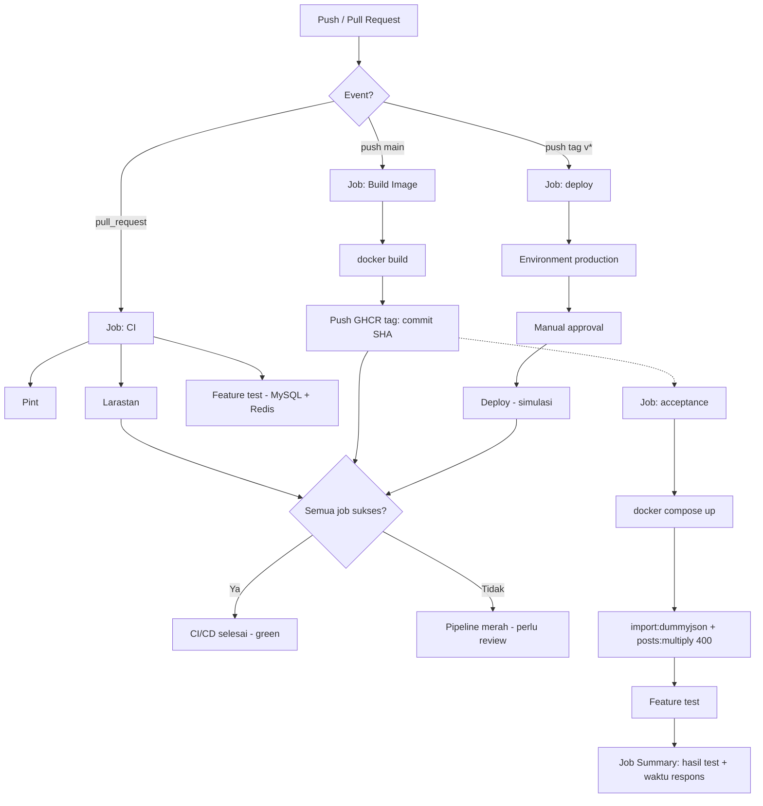

# Tugas Backend — Al-Inarah

Backend API artikel yang dibangun dengan **Laravel 13**, **PostgreSQL**, **Redis**, **Meilisearch**, dan **Mailpit**, berjalan sepenuhnya di **Docker Compose** tanpa server eksternal.

Semua data berasal dari [DummyJSON](https://dummyjson.com) dan diimpor ke database lokal melalui perintah `php artisan import:dummyjson`.

---

## Daftar Isi

1. [Teknologi & Arsitektur](#teknologi--arsitektur)
2. [Cara Menjalankan Project](#cara-menjalankan-project)
3. [Perintah Artisan](#perintah-artisan)
4. [Soal 1 — Import Data](#soal-1--import-data)
5. [Soal 2 — API Artikel](#soal-2--api-artikel)
6. [Soal 3 — Data Besar & Index Database](#soal-3--data-besar--index-database)
7. [Soal 4 — Pencarian Artikel](#soal-4--pencarian-artikel)
8. [Soal 5 — Statistik dengan Cache Redis](#soal-5--statistik-dengan-cache-redis)
9. [Soal 6 — Like, Event, dan Queue](#soal-6--like-event-dan-queue)
10. [Soal 7 — CI/CD](#soal-7--cicd)
11. [Feature Test](#feature-test)
12. [Dokumentasi Lain](#dokumentasi-lain)

---

## Teknologi & Arsitektur

| Komponen | Teknologi |
|---|---|
| Framework | Laravel `^13.17` (PHP `8.4`) |
| Database | PostgreSQL 17 |
| Cache & Queue | Redis 7 (phpredis) |
| Search engine | Meilisearch + Laravel Scout |
| Mail catcher | Mailpit |
| Queue processing | Laravel Job Batch + Queue Worker |

```text
┌────────────────────────────────────────────────────────────────┐
│                        Docker Compose                          │
│                                                                │
│  ┌───────────┐   ┌───────────────┐   ┌──────────────────────┐  │
│  │   app     │──▶│ queue-worker  │──▶│      meilisearch     │  │
│  │  :8000    │   │ queue:work    │   │        :7700         │  │
│  └─────┬─────┘   └───────┬───────┘   └──────────▲───────────┘  │
│        │                 │                     │              │
│        ▼                 ▼                     │              │
│  ┌───────────┐   ┌─────────────┐               │              │
│  │    db     │   │    redis    │───────────────┘              │
│  │ postgres  │   │   :6379     │                              │
│  └───────────┘   └─────────────┘                              │
│  ┌─────────────┐                                             │
│  │   mailpit   │  SMTP :1025 · UI :8025                       │
│  └─────────────┘                                             │
└────────────────────────────────────────────────────────────────┘
```

### Service di Docker Compose

| Service | Container | Port | Keterangan |
|---|---|---|---|
| `app` | `laravel-app` | `8000:8000` | Laravel + `php artisan serve` |
| `queue-worker` | `laravel-queue-worker` | — | `php artisan queue:work redis --tries=3` |
| `db` | `laravel-db` | `5432:5432` | PostgreSQL 17 (healthcheck aktif) |
| `redis` | `laravel-redis` | `6379:6379` | Redis dengan `--appendonly yes` (healthcheck aktif) |
| `mailpit` | `laravel-mailpit` | `8025:8025`, `1025:1025` | UI web + SMTP server |
| `meilisearch` | `laravel-meilisearch` | `7700:7700` | Search engine |

> **Catatan port**: assignment mensyaratkan API di `http://localhost:8080`, sedangkan `docker-compose.yml` saat ini memetakan service `app` ke `8000:8000`. Gunakan URL yang sudah berjalan di compose ini: **http://localhost:8000**.

---

## Cara Menjalankan Project

### Prasyarat

- Docker Engine + Docker Compose plugin (`docker compose version`)
- Koneksi internet (untuk `composer install`, pull image, dan fetch data DummyJSON)

### Langkah

```bash
# 1. Clone repository
git clone https://github.com/ajitirto/tugas-backend-alinarah.git
cd tugas-backend-alinarah

# 2. Jalankan semua service (tanpa langkah manual)
docker compose up -d --build
```

`docker compose up -d` menjalankan semuanya secara otomatis:

```text
app (container) ──▶ php artisan migrate:refresh --force        # buat skema DB
                 ──▶ php artisan import:dummyjson             # import DummyJSON (Soal 1)
                 ──▶ php artisan posts:multiply 400           # perbanyak artikel (Soal 3)
                 ──▶ php artisan scout:import Post            # index Meilisearch (Soal 4)
                 ──▶ php artisan serve --host=0.0.0.0 --port=8000
```

Queue worker (`queue-worker`) ikut berjalan otomatis, sehingga job batch import, email, dan sinkronisasi search index langsung diproses.

> **Penting**: command `app` memakai `migrate:refresh --force`, artinya setiap container `app` dimulai ulang, database di-reset lalu diisi ulang. Data persisten tetap aman di volume `postgres_data` selama container tidak dihapus dengan `-v`. Untuk mengulang dari nol: `docker compose down -v && docker compose up -d --build`.

### URL yang dapat diakses

| Service | URL |
|---|---|
| API Laravel | http://localhost:8000 |
| Mailpit (UI) | http://localhost:8025 |
| Meilisearch (debug) | http://localhost:7700 |

Contoh cek cepat:

```bash
curl http://localhost:8000/api/ping
# {"ok":true}
```

### Menjalankan tanpa Docker (opsional)

```bash
composer install
cp .env.example .env && php artisan key:generate
# sesuaikan .env (DB, REDIS, SCOUT_DRIVER=meilisearch, MAIL_MAILER=smtp, MAIL_HOST=127.0.0.1, MAIL_PORT=1025)
php artisan migrate --force
php artisan import:dummyjson
php artisan posts:multiply 400
php artisan scout:import "App\Models\Post"
php artisan queue:work redis --tries=3   # terminal terpisah
php artisan serve --host=0.0.0.0 --port=8000
```

---

### Testing REST API

Koleksi request siap pakai (HTTPie) tersedia di **`docs/api-test.http`** — mencakup seluruh endpoint dari Soal 2, 5, dan 6:

```bash
http GET :8000/api/posts                      # list artikel
http GET :8000/api/posts tag==history sort==-views   # filter tag + sort
http GET :8000/api/posts/1                    # detail artikel
http GET :8000/api/users/1/posts              # artikel milik user
http POST :8000/api/posts title="Artikel" body="Isi" user_id:=1
http POST :8000/api/posts/1/like              # like artikel
http GET :8000/api/search q==history          # pencarian (Meilisearch)
http GET :8000/api/stats/top-tags             # statistik (X-Cache)
http GET :8000/api/stats/top-authors          # statistik (X-Cache)
```

 endpoint statistik menyertakan **`X-Cache: HIT/MISS`**.

---

## Perintah Artisan

| Perintah | Fungsi |
|---|---|
| `php artisan import:dummyjson` | Mengambil posts, users, comments dari DummyJSON dan menyimpannya ke database via job batch |
| `php artisan posts:multiply {jumlah}` | Menyalin seluruh artikel sebanyak `{jumlah}` kali (Soal 3) |
| `php artisan scout:import "App\Models\Post"` | Mengisi ulang index Meilisearch dari tabel `posts` |

Ada juga target `make` sebagai pintasan:

```bash
make migrate-refresh     # php artisan migrate:refresh
make import-dummyjson    # php artisan import:dummyjson
make multiply-post       # php artisan posts:multiply 400
make scout-import        # php artisan scout:import "App\Models\Post"
make all                 # keempat perintah di atas berurutan
```

---

## Soal 1 — Import Data

Perintah: `php artisan import:dummyjson`

Implementasi: `app/Console/Commands/ImportDummyJsonCommand.php` + `app/Jobs/Import{Users,Posts,Comments}Job.php`.

### Alur kerja

1. `app/Services/DummyJsonService` mengambil seluruh data DummyJSON:
   - `https://dummyjson.com/posts?limit=0`
   - `https://dummyjson.com/users?limit=0`
   - `https://dummyjson.com/comments?limit=0`
2. Data dipecah menjadi **job batch** (`Bus::batch`), masing-masing job memproses chunk 500 record.
3. Progress batch (persentase) tampil live di terminal, dengan timeout 60 detik.
4. Setiap job memakai **`upsert`** berdasarkan kolom `id`, sehingga **menjalankan command 2 kali tidak membuat data dobel**.

### Mapping data

| Sumber DummyJSON | Kolom DB |
|---|---|
| `posts.views` | `posts.views` |
| `posts.reactions.likes` | `posts.likes` |
| `posts.tags` | `posts.tags` (jsonb) |
| `users.id`, `firstName`, `lastName`, `username`, `email` | `users.*` — **tanpa password / data sensitif** |
| `comments.body`, `likes`, `user.id`, `postId` | `comments.body`, `likes`, `user_id`, `post_id` |

### Idempotensi

- `User::upsert(..., ['id'], ...)`, `Post::upsert(..., ['id'], ...)`, `Comment::upsert(..., ['id'], ...)` — record dengan ID sama akan di-update, bukan disisipkan ganda.
- Setelah import posts, sequence `posts.id` disinkronkan (`setval`) agar pembuatan artikel baru tidak bentrok dengan ID DummyJSON.

---

## Soal 2 — API Artikel

### Endpoint

| Method | Endpoint | Keterangan |
|---|---|---|
| GET | `/api/posts` | Daftar artikel, pagination `page` & `per_page` (default 10, maks 100) |
| GET | `/api/posts?tag=history&sort=-views` | Filter tag + urut berdasarkan views |
| GET | `/api/posts/{id}` | Detail artikel + penulis + komentar |
| GET | `/api/users/{id}/posts` | Daftar artikel milik satu user |
| POST | `/api/posts` | Membuat artikel baru (rate limit 10/menit/IP) |

Semua handler ada di `app/Http/Controllers/Api/PostController.php`, query di `app/Repositories/PostRepository.php`.

### Header global

Semua response API diwajibkan menyertakan header **`X-Api-Build: tulip-58`** sesuai assignment. Header ini disediakan oleh middleware `app/Http/Middlleware/ApiBuildHeader.php`.

> **Catatan**: pada kode saat ini, registrasi middleware-nya masih dikomentari di `bootstrap/app.php`. Registrasikan kembali (mis. `$middleware->api(append: [ApiBuildHeader::class])`) agar header benar-benar terkirim di semua response.

### Format respons umum

```json
{
  "data": [
    {
      "id": 1,
      "title": "...",
      "tags": ["history"],
      "views": 0,
      "likes": 0,
      "user_id": 1
    }
  ],
  "meta": { "page": 1, "per_page": 10, "total": 0 }
}
```

`meta` menyertakan `page`, `per_page`, dan `total` untuk setiap respons ber-pagination.

### Detail `GET /api/posts/{id}`

```json
{
  "data": {
    "id": 1,
    "title": "...",
    "body": "...",
    "tags": ["history"],
    "views": 0,
    "likes": 0,
    "user": { "id": 1, "username": "..." },
    "comments": [
      { "id": 1, "body": "...", "user": { "id": 1, "username": "..." } }
    ]
  }
}
```

### `POST /api/posts`

Body (JSON):

| Field | Aturan |
|---|---|
| `title` | wajib, string, maksimal 255 karakter |
| `body` | wajib, string |
| `user_id` | wajib, integer, harus ada di tabel `users` |
| `tags` | opsional, array of string |

Validasi memakai **Form Request** `app/Http/Requests/StorePostRequest.php`. Jika gagal → `422` dengan format error bawaan Laravel:

```json
{
  "message": "The title field is required. (and 1 more error)",
  "errors": {
    "title": ["The title field is required."],
    "user_id": ["The selected user id is invalid."]
  }
}
```

Sukses → `201`:

```json
{
  "data": {
    "id": 100652,
    "title": "Artikel baru",
    "tags": [],
    "views": 0,
    "likes": 0,
    "user_id": 1
  }
}
```

Contoh request:

```bash
curl -X POST http://localhost:8000/api/posts \
  -H "Content-Type: application/json" \
  -H "Accept: application/json" \
  -d '{"title":"Artikel baru","body":"Isi artikel","user_id":1}'
```

### Rate limit

`POST /api/posts` dibatasi **10 request per menit per IP** via `RateLimiter::for('create-post')` (`app/Providers/AppServiceProvider.php`). Lebih dari itu → **`429`** dengan header `Retry-After`.

### Penanganan error

- Data tidak ditemukan → `404` JSON:
  - `GET /api/posts/{id}` → `{"message": "Post not found."}`
  - `GET /api/users/{id}/posts` → `{"message": "User not found."}`
- Error non-JSON otomatis dikonversi ke JSON untuk semua route `api/*` (`shouldRenderJsonWhen` di `bootstrap/app.php`).

### Anti N+1

Query memakai eager loading (`->with()`):

- `PostRepository::getPosts()` → `with('user')`
- `PostRepository::findById()` → `with(['user', 'comments.user'])`
- `PostRepository::getPostsByUser()` → `with('user')`

---

## Soal 3 — Data Besar & Index Database

### Memperbanyak data

```bash
php artisan posts:multiply 400
```

- 251 artikel hasil import disalin **400 kali** (title, body, tags, views, likes, dan user yang sama).
- Total artikel menjadi **251 + (251 × 400) = 100.651**.
- Command ini sudah dijalankan otomatis oleh container `app` saat `docker compose up -d`.

### Index yang ditambahkan

Migration `database/migrations/2026_09_15_025131_add_indexes_to_posts_users_comments_tables.php`:

| Tabel | Index | Untuk query |
|---|---|---|
| `posts` | `(tags, views)` B-tree | filter tag + urut `views` |
| `posts` | `(user_id)` | artikel per user |
| `comments` | `(post_id)` | komentar per artikel |
| `comments` | `(user_id)` | user pada komentar |

### Hasil EXPLAIN sebelum & sesudah index

Pengukuran memakai skrip `scripts/analysize-indexes.sh` (pgcli + `EXPLAIN ANALYZE`) pada PostgreSQL 17.4.

| Query | Sebelum index | Sesudah index |
|---|---|---|
| Filter tag `history` + sort `views DESC` | `Seq Scan` + `Sort (external merge, Disk 8.8MB)` — **57.612 ms** | `Parallel Seq Scan` + `Gather Merge` + `quicksort` — **27.569 ms** |
| Artikel per user (`user_id = 1`) | `Seq Scan` (filter 100.250 baris) — **15.279 ms** | `Bitmap Index Scan` pakai `posts_user_id_index` — **2.114 ms** |
| Komentar per artikel (`post_id = 1`) | `Seq Scan` — **0.143 ms** | `Seq Scan` (data kecil) — **0.051 ms** |

Output lengkap:

- [docs/before-index.md](docs/before-index.md) — hasil pengujian sebelum index.
- [docs/after-index.md](docs/after-index.md) — hasil pengujian setelah index.

### Waktu respons endpoint (Soal 2 & 3)

Pengukuran manual dengan HTTPie terhadap `GET /api/posts?tag=history&sort=-views` (data 100.651 artikel):

```bash
http GET :8000/api/posts tag==history sort==-views
# 0,15s user 0,04s system 50% cpu 0,386 total
```

> Target soal: endpoint merespons di **bawah 200 ms**. Pengukuran `0,386 total` di atas adalah waktu sisi klien (HTTPie) secara end-to-end yang mencakup koneksi, eksekusi PHP/Laravel, dan transfer data; sementara eksekusi query-nya sendiri 27,569 ms (lihat EXPLAIN). Waktu aktual sangat bergantung pada environment (Docker, spesifikasi mesin, koneksi HTTP).

---

## Soal 4 — Pencarian Artikel

Endpoint: `GET /api/search?q=`

Implementasi: `app/Http/Controllers/Api/SearchController.php` + `app/Models/Post.php` (trait `Laravel\Scout\Searchable`).

```json
{ "data": [ { "id": 1, "title": "...", "body": "..." } ] }
```

Data yang di-index hanya `id`, `title`, dan `body` (`toSearchableArray()`). Pencarian dibatasi 20 hasil (`take(20)`). Jika `q` kosong → `{"data": []}`.

### Alasan memilih Meilisearch

1. **Typo tolerance built-in** — pencarian `histroy` tetap menemukan artikel berisi kata `history`.
2. **Cepat untuk full-text search**, jauh lebih responsif daripada `ILIKE '%q%'` di PostgreSQL untuk 100.651 baris.
3. **Mudah dijalankan via Docker Compose** — lingkungan search engine dapat direproduksi satu perintah.
4. **Integrasi dengan Laravel Scout** sederhana, tanpa implementasi search engine manual.
5. **Asynchronous indexing** — `SCOUT_QUEUE=true` membuat sinkronisasi index berjalan lewat queue, sehingga artikel baru bisa dicari **paling lambat 5 detik** setelah dibuat tanpa memperlambat request.
6. Mudah di-deploy dan gratis untuk kebutuhan assignment (development mode).

### Arsitektur pencarian

```text
Laravel API
    │
    ├── PostgreSQL
    │      └── Source of Truth
    │
    └── Laravel Queue  (SCOUT_QUEUE=true)
            │
            ▼
       Meilisearch
            │
            ▼
       GET /api/search?q=
```

PostgreSQL tetap menjadi sumber data utama; Meilisearch hanya search index untuk mempercepat pencarian dan menyediakan typo tolerance.

Contoh request:

```bash
curl "http://localhost:8000/api/search?q=history"
curl "http://localhost:8000/api/search?q=histroy"   # tetap menemukan "history"
```

### Benchmark

Pengukuran dengan HTTPie (10 iterasi `GET /api/search?q=history`):

```bash
for i in {1..10}; do
  time http GET 'http://localhost:8000/api/search?q=history' > /dev/null
done
# rata-rata ±300 ms (end-to-end sisi klien)
```

| Endpoint | Rata-rata |
|---|---|
| `/api/ping` | 271 ms |
| `/api/search?q=history` | 324 ms |
| Overhead search (Laravel → Scout → Meilisearch) | ~53 ms |

> Target soal: respons di **bawah 100 ms** di sisi server. Nilai di atas adalah pengukuran end-to-end sisi klien (HTTPie) di environment Docker lokal. Overhead murni pencarian di atas `/api/ping` hanya **±53 ms**. Hasil benchmark sangat dipengaruhi environment pengujian (Docker, web server, koneksi ke Meilisearch, kondisi mesin).

---

## Soal 5 — Statistik dengan Cache Redis

### Endpoint

| Method | Endpoint | Keterangan |
|---|---|---|
| GET | `/api/stats/top-tags` | 5 tag paling banyak dipakai; jika count sama, diurutkan A→Z |
| GET | `/api/stats/top-authors` | 3 user dengan total views tertinggi |

Implementasi: `app/Http/Controllers/StatsController.php` + `app/Services/StatsService.php`.

Contoh respons:

```json
// GET /api/stats/top-tags
[
  { "tag": "history", "count": 22456 },
  { "tag": "english", "count": 19248 },
  { "tag": "american", "count": 18847 }
]

// GET /api/stats/top-authors
[
  { "user_id": 126, "username": "averya", "total_views": 5390242 },
  { "user_id": 150, "username": "stellas", "total_views": 4469145 },
  { "user_id": 83, "username": "dylanw", "total_views": 4135914 }
]
```

### Ketentuan yang dipenuhi

1. **Statistik dihitung dengan query database**, bukan loop di kode:
   - `top-tags`: `jsonb_array_elements_text(tags)` + `GROUP BY` + `ORDER BY count DESC, tag ASC LIMIT 5`.
   - `top-authors`: `JOIN users` + `SUM(posts.views)` + `GROUP BY` + `ORDER BY total_views DESC LIMIT 3`.
2. **Cache Redis** — hasil disimpan dengan key `stats:heron:top-tags` dan `stats:heron:top-authors` (prefix `stats:heron:`). Response menyertakan header **`X-Cache: HIT`** (dari cache) atau **`X-Cache: MISS`** (dihitung ulang).
3. **Statistik selalu benar setelah artikel baru** — cache dibersihkan otomatis oleh `PostObserver` (`created`/`updated`/`deleted`) dan `PostService::createPost()`.
4. **Single-flight** — jika cache kosong dan banyak request datang bersamaan, hanya 1 query yang berjalan: `Cache::lock("{key}:lock", 10)` memastikan request lain menunggu (`$lock->block(10)`) dan membaca hasil dari cache (HIT).

Test terkait: `tests/Feature/Api/StatsTest.php` (MISS → HIT, top authors, dan invalidasi cache setelah post dibuat).

---

## Soal 6 — Like, Event, dan Queue

### 1. Endpoint like

`POST /api/posts/{id}/like`

- Implementasi: `PostRepository::incrementLikes()` memakai **`$post->increment('likes')`** (increment atomik di level database).
- Jika 100 request dikirim bersamaan, `likes` naik tepat 100 — tidak ada race condition.

```bash
curl -X POST http://localhost:8000/api/posts/1/like
# {"message":"Post liked successfully.","likes":1}
```

### 2. Event saat artikel dibuat

Alur:

```text
POST /api/posts
      │
      ▼
PostService::createPost()
      │
      ├── event(new PostCreated($post))          # app/Events/PostCreated.php
      │        │
      │        ▼
      │   Listener SendPostCreatedNotification   # ShouldQueue
      │        │                                 # app/Listeners/
      │        ▼
      │   Mail::to(penulis)->send(PostCreatedMail)  # app/Mail/PostCreatedMail.php
      │        │                                 # view: resources/views/emails/posts/created.blade.php
      │        ▼
      │   SMTP → mailpit (:1025) → UI http://localhost:8025
      │
      └── Cache::forget(stats:heron:*)            # statistik langsung akurat
```

- Listener `SendPostCreatedNotification` berjalan di **queue** (`ShouldQueue`).
- Email dikirim ke **email penulis** (`users.email`) dan dapat dilihat di **Mailpit** http://localhost:8025.

### 3. Retry & failed job

- Listener mendefinisikan **`tries = 3`** dengan backoff progresif **`[5, 10, 20]` detik**.
- Queue worker berjalan dengan `--tries=3` (`docker-compose.yml` → service `queue-worker`).
- Job yang tetap gagal setelah 3 percobaan tercatat di tabel **`failed_jobs`** (migration `0001_01_01_000002_create_jobs_table.php`).

### 4. Queue worker otomatis

Service `queue-worker` pada docker compose menjalankan `php artisan queue:work redis --verbose --tries=3` sejak container start — tidak perlu perintah manual. Redis dipakai sebagai queue connection (`QUEUE_CONNECTION=redis`).

---

## Soal 7 — CI/CD

Pipeline CI/CD didefinisikan di GitHub Actions dengan nama workflow **`verify-merak`**. Nama job deploy di workflow tersebut: **`deploy`**.

### Job dan trigger

| Trigger | Job | Aksi |
|---|---|---|
| `pull_request` | **CI** | Menjalankan **Pint** (code style), **Larastan** (static analysis), dan **feature test** menggunakan **MySQL + Redis** sebagai service container |
| `push` ke `main` | **Build Image** | `docker build` lalu **push ke GHCR** dengan tag **commit SHA** (`ghcr.io/ajitirto/tugas-backend-alinarah:<sha>`) |
| `push` tag `v*` | **deploy** (manual approval) | Deploy ke environment `production` yang membutuhkan **approval manual**. Target deploy boleh simulasi |
| `push` ke `main` (atau trigger manual) | **acceptance** | `docker compose up -d`, jalankan `import:dummyjson` + `posts:multiply 400`, jalankan feature test, catat **hasil test dan waktu respons setiap endpoint** ke **Job Summary** GitHub Actions |

### Diagram alur CI/CD



### Cara rollback

Rollback dilakukan dengan **men-deploy ulang image commit SHA sebelumnya** yang sudah ada di GHCR:

```bash
# 1. Lihat image yang pernah di-push
docker pull ghcr.io/ajitirto/tugas-backend-alinarah:<sha-sebelumnya>

# 2. Ubah tag image ke versi yang stabil / langsung deploy SHA lama
docker tag ghcr.io/ajitirto/tugas-backend-alinarah:<sha-sebelumnya> \
           ghcr.io/ajitirto/tugas-backend-alinarah:rollback

# 3. Pada environment production, ganti image service `app` dengan tag rollback,
#    lalu restart:
docker compose up -d --force-recreate app
```

Langkah alternatif:

1. **Revert commit** — `git revert <sha>` lalu push ke `main` → pipeline build otomatis membuat image baru dengan tag SHA baru.
2. **Approve kembali** — jika rollback butuh production, trigger job `deploy` dengan tag `v*` baru atau re-run workflow deployment yang lama.
3. **Verifikasi** — cek endpoint `/api/ping`, data artikel (`/api/posts`), dan statistik (`/api/stats/top-tags`) setelah rollback.

Karena image untuk setiap commit SHA tetap tersimpan di GHCR, rollback ke versi mana pun selalu mungkin tanpa membangun ulang dari nol.

---

## Feature Test

Terdapat **24 feature test** pada 8 file di `tests/Feature/Api/` (memenuhi syarat minimal 10 test):

| File | Jumlah test | Cakupan |
|---|---|---|
| `PingTest.php` | 1 | Health check `/api/ping` |
| `PostIndexTest.php` | 5 | List artikel, pagination, cap `per_page=100`, filter tag, sort views desc |
| `PostShowTest.php` | 3 | Detail artikel, include komentar, 404 |
| `PostStoreTest.php` | 5 | Create, validasi 422, user must exist, event notifikasi, rate limit |
| `UserPostsTest.php` | 2 | Artikel per user, 404 user tidak ada |
| `SearchTest.php` | 3 | Search kosong, tanpa query, hasil dari Meilisearch |
| `StatsTest.php` | 3 | `X-Cache` MISS→HIT, top authors, invalidasi cache |
| `PostLikeTest.php` | 2 | Like increment, 404 post tidak ada |

Menjalankan test:

```bash
docker compose exec app php artisan test
# atau local:  php artisan test
```

Environment test memakai PostgreSQL (`laravel_test`) dan `CACHE_STORE=array` + `QUEUE_CONNECTION=sync` (lihat `phpunit.xml`).

---

## Dokumentasi Lain

- [docs/before-index.md](docs/before-index.md) — hasil EXPLAIN dan waktu query **sebelum** index ditambahkan (Soal 3).
- [docs/after-index.md](docs/after-index.md) — hasil EXPLAIN dan waktu query **sesudah** index ditambahkan (Soal 3).
- Skrip pengukuran: `scripts/analysize-indexes.sh`
